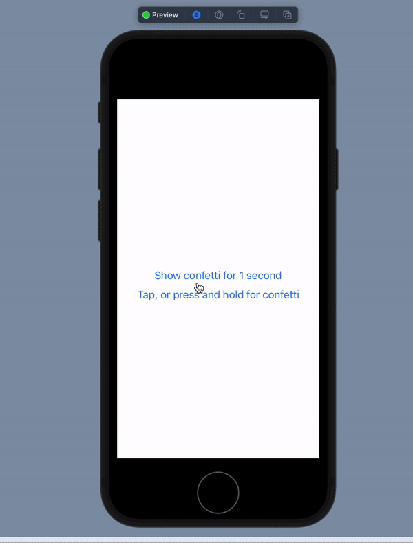

# Confetti Demo

This a proof of concept of a confetti view in SwiftUI. I'm using it in production in my apps [Personal Best](https://getpersonalbest.com) and [Taylor's Version](https://taylorsversion.app). It runs smoothly at 60fps (120fps on ProMotion-enabled devices) and includes haptic feedback.

## Demo



The main interface is a `View` extension, which allows confetti to be attached to any view:

```swift
Text("Hello world")
    .withConfetti(isVisible: $confettiVisible)
```

See `ContentView.swift` for where it's used.